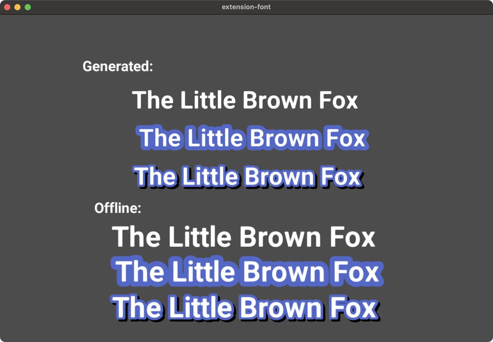

# Font extension

Defold [native extension](https://defold.com/manuals/extensions/) for interacting with fonts at runtime.

This extension allows for extending an existing Defold font (.fontc) with more glyphs at runtime.

It allows for smaller package sizes, as well as less runtime memory footprint.

Known limitations:
* You need to add your .ttf font as a [Custom Resource](https://defold.com/manuals/project-settings/#custom-resources)
* It is not recommended to mix glyphs from the default (offline) glyph generator and this runtime generator.
    * Note: It is possible to override the previous glyphs at runtime, making the look consisten
* Currently only supports SDF fonts
* No caching to disc of the the generated glyphs

# Game.project Properties

See [ext.properties](./fontgen/ext.properties) for relevant settings.

# Api

[Script Api](./fontgen/fontgen.script_api)

# Font Credits

* [Roboto](https://fonts.google.com/specimen/Roboto) by [Christian Robertson](https://fonts.google.com/?query=Christian+Robertson)
