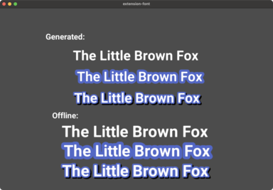

# DEPRECATED !!!

This extension has now been superceded by cor functionality in Defold 1.12.0.
See [the documentation](https://defold.com/manuals/font/#text-layout-support-eg-right-to-left) for further information on how to use the feature.

<strike>
# Documentation

Defold [native extension](https://defold.com/manuals/extensions/) for interacting with fonts at runtime.

* [Api](https://defold.com/extension-fontgen/fontgen_api/)
* [Doc](https://defold.com/extension-fontgen)

 

</strike>
